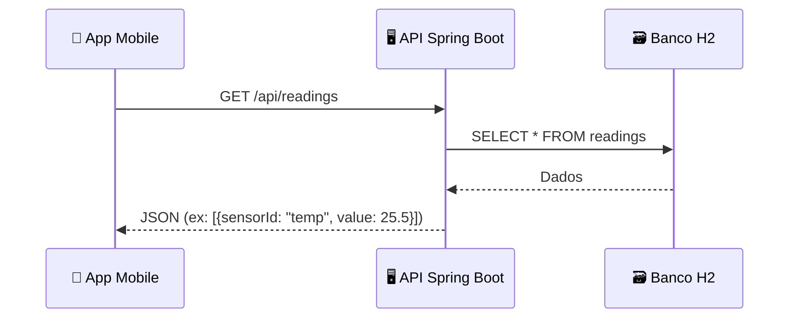

# 🚀 AetherWorks - Digital Twin System  

**Sistema de monitoramento industrial** com Digital Twin, composto por:  

|                          |                         |
|--------------------------|-------------------------|
| **📱 Aplicativo Mobile** | (React Native)          |
| **🖥️ Backend API**       | (Java Spring Boot + H2) |

## 📂 Estrutura do Projeto  

```plaintext
aether-works/
├─ mobile/
├─ service/
└─ README.md
```


## 📊 Diagrama de Arquitetura

<div align="center">


</div>


## 👥 Integrantes

| Nome                 | RM     |
|----------------------|--------|
| Rodrigo Panisi Pombo | 550755 |
| Guilherme Pinheiro   | 99839  |
| Nilton P G V Miranda | 97868  |
| João Gabriel Vianna  | 551963 |


## 📝 Licença

Projeto acadêmico desenvolvido para FIAP em parceria com FESTO.