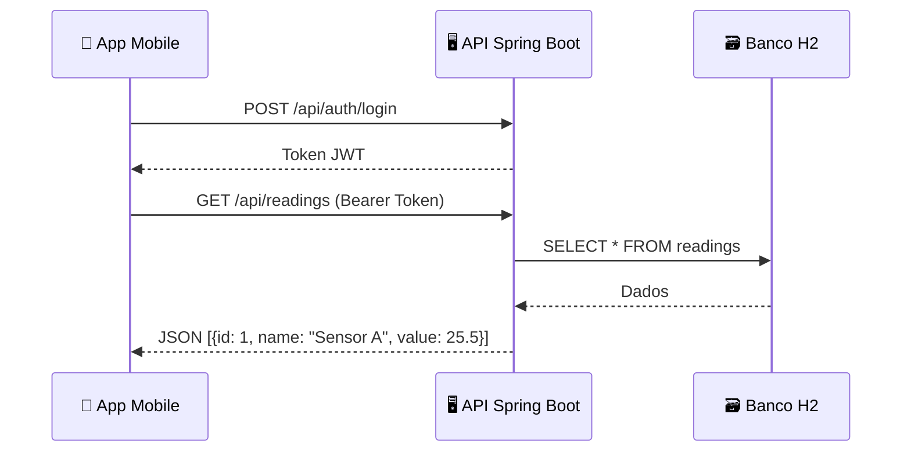

# 🚀 AetherWorks - Digital Twin System  

**Sistema de monitoramento industrial** com Digital Twin, desenvolvido como projeto da FIAP, integrando sensores físicos e gêmeos digitais em tempo real.

---

## 📱 Aplicativo Mobile
Desenvolvido em **React Native (Expo)** para exibir, cadastrar e editar sensores conectados ao sistema.  
Integração via **API REST com autenticação JWT**.

---

## 🖥️ Backend API
Construído em **Java Spring Boot**, responsável por:  
- Gerenciar os dados de sensores (`SensorModel`)  
- Controlar usuários e autenticação JWT (`UserModel`)  
- Conectar-se ao banco de dados **H2** (modo dev) ou **PostgreSQL** (produção)  
- Expor endpoints REST protegidos  

---

## 📂 Estrutura do Projeto  

```plaintext
aether-works/
├─ mobile/                # Aplicativo React Native
│  ├─ app/                # Rotas e telas
│  ├─ contexts/           # Contextos (Auth, Sensors)
│  ├─ services/           # Axios + Interceptores JWT
│  └─ components/         # Cards, Modais e UI
│
├─ service/               # API Spring Boot
│  ├─ src/main/java/
│  │  ├─ controller/      # Controllers REST
│  │  ├─ models/          # Entidades (User, Sensor)
│  │  ├─ services/        # Regras de negócio
│  │  ├─ security/        # JWT e filtros de autenticação
│  │  └─ repository/      # JPA Repositories
│  └─ src/main/resources/
│     ├─ application.properties
│     └─ data.sql         # Dados iniciais (opcional)
│
└─ README.txt
```

---

## 📊 Diagrama de Arquitetura


```mermaid
sequenceDiagram
    participant App as 📱 App Mobile
    participant API as 🖥️ API Spring Boot
    participant DB as 🗃️ Banco H2

    App->>API: POST /api/auth/login
    API-->>App: Token JWT

    App->>API: GET /api/readings (Bearer Token)
    API->>DB: SELECT * FROM readings
    DB-->>API: Dados
    API-->>App: JSON [{id: 1, name: "Sensor A", value: 25.5}]
```

---

## ⚙️ Como executar

### 🖥️ Backend (Spring Boot)
```bash
cd service
./mvnw spring-boot:run
```

> A API iniciará em: **http://localhost:8080**

Endpoints principais:
- `POST /api/auth/register` → cria usuário  
- `POST /api/auth/login` → retorna token JWT  
- `GET /api/readings` → lista sensores (requer token)  

---

### 📱 Mobile (React Native)
```bash
cd mobile
npm install
npm start
```

> Acesse via **Expo Go** ou emulador Android/iOS.  
> O app consome a API em `http://localhost:8080/api` *(ajuste o IP se estiver no dispositivo físico)*.

---

## 🔐 Autenticação JWT

O fluxo de autenticação é composto por:
1. Usuário faz login via `/api/auth/login`
2. A API gera um token JWT com 24h de validade
3. O app armazena o token com `AsyncStorage`
4. Todas as requisições subsequentes enviam o header:
   ```
   Authorization: Bearer <token>
   ```
5. O Spring Security valida o token via `JwtAuthFilter`

---

## 🧠 Tecnologias utilizadas

| Camada | Tecnologias |
|---------|-------------|
| **Backend** | Java 17, Spring Boot, Spring Security, JPA, JWT, H2 / PostgreSQL |
| **Frontend (App)** | React Native, Expo, Axios, AsyncStorage, Context API |
| **DevOps / Outros** | Git, Node.js, VS Code, Postman |

---

## 👥 Integrantes

| Nome                 | RM     |
|----------------------|--------|
| Rodrigo Panisi Pombo | 550755 |
| Guilherme Pinheiro   | 99839  |
| Nilton P G V Miranda | 97868  |
| João Gabriel Vianna  | 551963 |

---

## 🧾 Licença

Projeto acadêmico desenvolvido para a **FIAP**, em parceria com **FESTO**.  
Uso exclusivo para fins educacionais.
